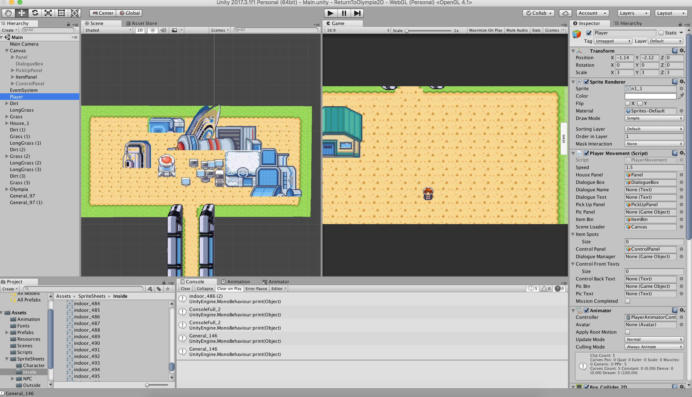

# Return to Olympia
Developer: Mark Zheng Ma
Game Designer: Daniel Ahn
## Description
A JRPG consisted with constructionism theory and endogenously teaches computational thoughts.
## Screenshots

## Technologies
C# + Unity
## Links to the Project 
Research Paper:  
https://docs.google.com/document/d/1SwG9PETFXn9i8VfMyrFfwv460IT5Z-LhR55vccK5QC4/edit  
Slides:  
https://docs.google.com/presentation/d/1biFXhc95RMlaC_j7hZI-CvjXWMMdvuKi3gizSNYLVRo/edit#slide=id.g37a27550a6_0_406